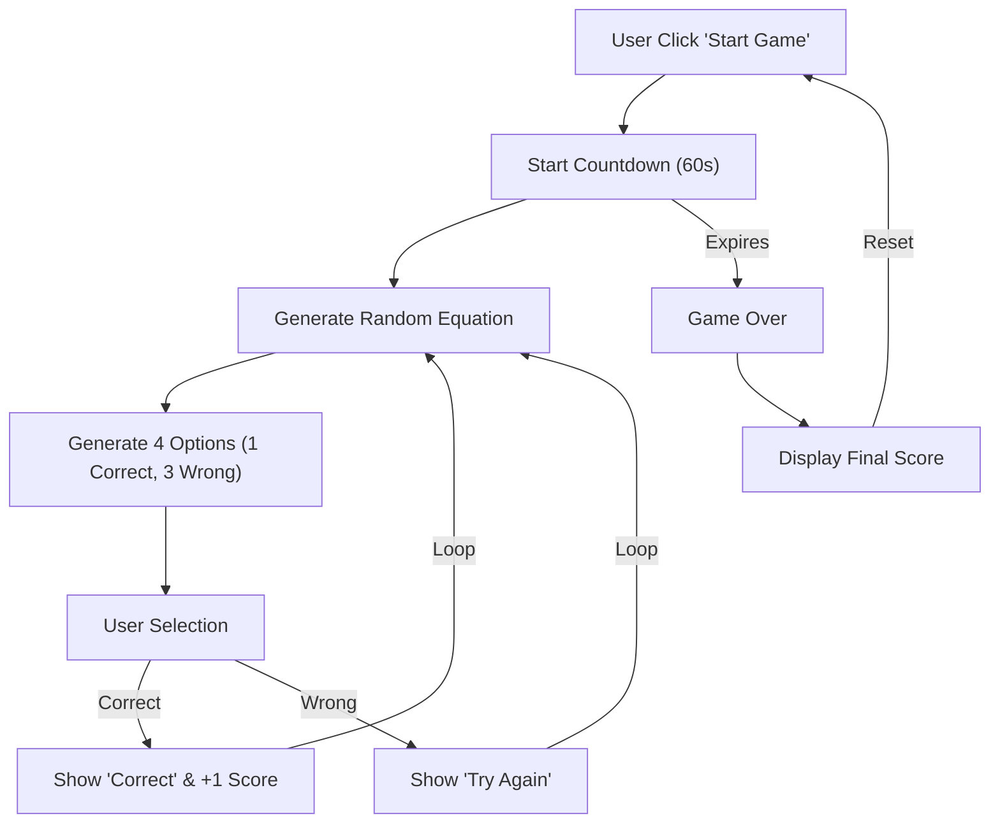

# Technical Specification: The Math Game

## Architectural Overview

**The Math Game** is an interactive educational web application designed to gamify arithmetic practice. It presents users with a rapid-fire series of mathematical equations where they must select the correct answer from multiple choices within a limited timeframe, promoting mental agility and calculation speed.

### Game Logic Flow

---

## Technical Implementations

### 1. Frontend Architecture
-   **Structure**: Semantic HTML5 defines the game container, score board, question interface, and answer grid.
-   **Styling**: CSS3 is used to create a clean, boxed layout with clear visual affordances for interactive elements (hover states, active clicks).
-   **Responsiveness**: The layout is fluid, adapting to different device widths (`viewport` meta tag) to ensure usability on mobile and desktop.

### 2. JavaScript Logic
-   **Core Modules**:
    -   `script.js`: Handles the entire game lifecycle.
    -   **Equation Logic**: Dynamically generates multiplication tables or simple arithmetic problems.
    -   **Randomization**: Algorithms ensure that the correct answer is randomly assigned to one of the four available slots (`box1` to `box4`).
-   **Event Handling**: Event listeners manage user clicks for starting/resetting the game and selecting answers.
-   **Timing Mechanism**: A `setInterval` function drives the 60-second countdown, triggering the "Game Over" state upon expiration.

### 3. Deployment Pipeline
-   **CI/CD**: The repository uses **GitHub Actions** to automatically deploy the `Source Code` artifact to **GitHub Pages**, providing an always-available live version of the game.

---

## Technical Prerequisites

-   **Runtime**: Standard modern web browser (Edge, Chrome, Firefox).
-   **Development**: Text editor and local server for testing (though logic is purely client-side).

---

*Technical Specification | Human Machine Interaction | Version 1.0*
